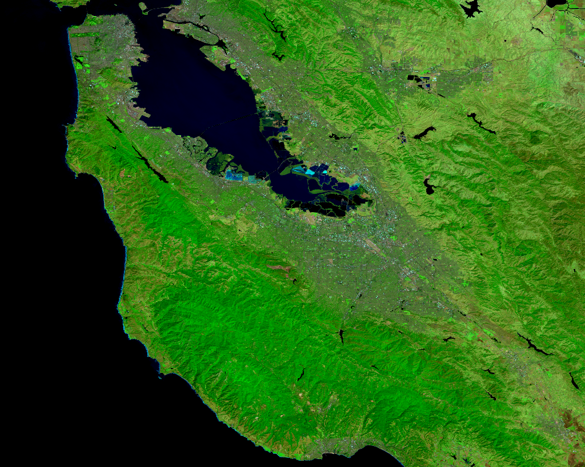

# Landsat 8 Cloud Masking


This example highlights how the EE Julia API can be used to create a function and apply over imagery. Example from the [Javascript Landsat8 Surface Reflectance example](https://code.earthengine.google.com/?scriptPath=Examples:Cloud%20Masking/Landsat8%20Surface%20Reflectance).

## Code

```julia
using EarthEngine
Initialize()

# Function to cloud mask from the pixel_qa band of Landsat 8 SR data.
function maskL8sr(image)
    image = EE.Image(image) # cast to make sure we have the correct type

    # Bits 3 and 5 are cloud shadow and cloud, respectively.
    cloudShadowBitMask = 1 << 3
    cloudsBitMask = 1 << 5

    # Get the pixel QA band.
    qa = select(image, "pixel_qa")

    # Both flags should be set to zero, indicating clear conditions.
    mask = And(
        eq(bitwiseAnd(qa, cloudShadowBitMask), 0),
        eq(bitwiseAnd(qa, cloudsBitMask), 0)
    )

    # Return the masked image, scaled to reflectance, without the QA bands.
    return copyProperties(
        select(
            divide(
                updateMask(
                    image,
                    mask
                ),
                10_000
            ),
            "B[0-9]*"
        ),
        image, ["system:time_start"]
    )
end

# get the landsat collection and filter by date
collection = filterDate(
    EE.ImageCollection("LANDSAT/LC08/C01/T1_SR"),
    "2016-01-01", "2016-12-31"
)

# apply the quality masking function
masked = map(collection, maskL8sr)

# calculate median pixel
composite = median(masked)

# define a region to view results
mntview = Point(-122.0839, 37.3861)
region = bounds(buffer(mntview, 5e4))

# get a link to view results
getThumbURL(composite, Dict(
    :bands => "B7,B5,B3",
    :min => 0.05,
    :max => 0.55,
    :gamma => 1.5,
    :region => region,
    :dimensions => 1024
))
```

## Expected result


