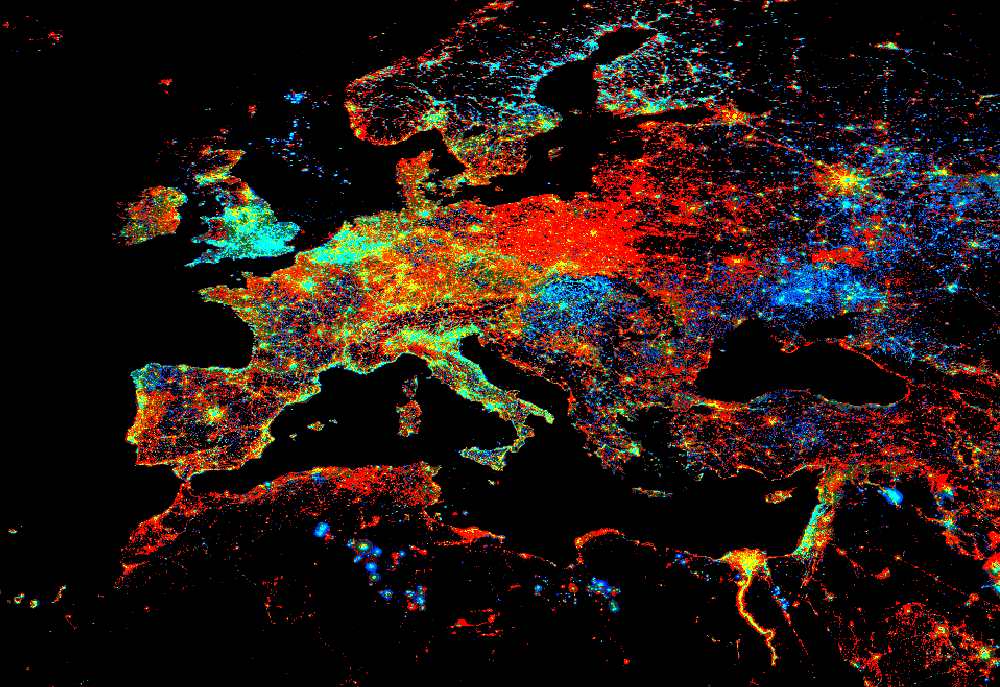

# Trendy Lights

This example highlights how the EE Julia API can be used to process time series of data and calculate a trend in time. Example from the [Javascript Trendy Lights example](https://code.earthengine.google.com/?scriptPath=Examples:Image%20Collection/Linear%20Fit).


## Code

```julia
using EarthEngine
Initialize()

# Add a band containing image date as years since 1990.
function createTimeBand(img)
  img = EE.Image(img)
  starttime = EE.Date("1990-01-01")
  year = difference(date(img), starttime, "year")
  return float(addBands(year,img))
end

# get night light collection and add time band
collection = map(
  select(
    EE.ImageCollection("NOAA/DMSP-OLS/CALIBRATED_LIGHTS_V4")
    ,"avg_vis"
  ), createTimeBand
)

# Fit a linear trend to the nighttime lights collection.
fit = reduce(collection, linearFit())

# define a region to view results
pt = Point(15, 45)
region = bounds(buffer(pt,25e5))

# Display trend in red/blue, brightness in green.
getThumbURL(fit, Dict(
  :min => 0,
  :max => (0.18, 20, -0.18,),
  :bands => ["scale", "offset", "scale"],
  :dimensions => 1024,
  :region => region,
  :format => "png"
))
```

## Expected Results


