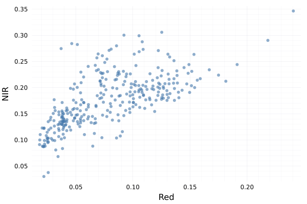
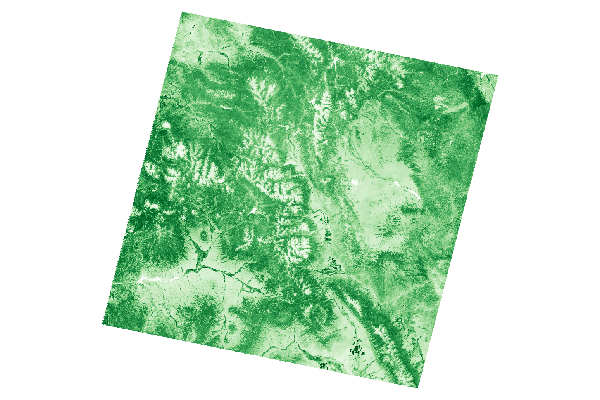

# EarthEngine.jl

[](https://github.com/KMarkert/EarthEngine.jl)
[](https://github.com/KMarkert/EarthEngine.jl/blob/main/LICENSE)

Google Earth Engine in Julia!

`EarthEngine.jl` is used to interface with the _amazing_ cloud-based geospatial processing platform, [Google Earth Engine](https://earthengine.google.com), using the [Julia](https://julialang.org/) programming language as a wrapper around the [EE Python API](https://developers.google.com/earth-engine/guides/python_install).

You can use `EarthEngine.jl` in the following two ways.

1. Interface with the good ole' object-oriented Python API that everyone knows and loves through Julia (i.e. `imagecollection.filterDate(...).mean()`)
2. Interface with Earth Engine using Julia-like syntax that leverages types and multiple (i.e. `(mean(filterDate(imagecollection,...)))`)

See the [Usage page](https://kmarkert.github.io/EarthEngine.jl/dev/usage/) of the documentation for more details on how to use.

## Why Julia + Earth Engine?

Earth Engine has become a vital geospatial tool for many Earth science researchers and organizations. The officially supported Earth Engine APIs are written in [JavaScript](https://developers.google.com/earth-engine/guides/getstarted) and [Python](https://developers.google.com/earth-engine/guides/python_install). The Python API provides great flexability and many useful packages for downstream analysis, but what about other scientific programming languages? Community-developed APIs, like [rgee](https://github.com/r-spatial/rgee/) are allowing developers to interface with EE using their favorite languages. This package provides the Earth Engine API for users who love programming in Julia!

Julia is a modern programming language that has the feel of a scripting language with the performance of compiled languages (thanks to its JIT compilation). Julia is full of features e.g. types and multiple dispatch that make developing EE workflows more expressive.

## Installation

To use Earth Engine with Julia, we will use the existing Python API and call the functions through Julia. This is done through Julia’s [PyCall package](https://github.com/JuliaPy/PyCall.jl) but we will need to install the EE API for use within the Julia environment. To do this, use the following instructions:

```julia
$ julia
julia> ]
pkg> add PyCall Conda
julia> using Conda
julia> Conda.add("earthengine-api", channel="conda-forge");
```

Now we can install the EarthEngine package. `EarthEngine.jl` is available through the Julia package registry, therefore you can install using the following code:

```julia
$ julia
julia> ]
pkg> add EarthEngine
julia> using EarthEngine
julia> Initialize()
```

If everything went well then you should have been able to import the EarthEngine package and initialize a session without any errors.

## Quick start

To get started illustrating how to execute EE workflows using Julia, some of the [examples using the Python API](https://colab.research.google.com/github/google/earthengine-api/blob/master/python/examples/ipynb/ee-api-colab-setup.ipynb) are replicated using the EE Julia API.

### Test the API

The first example is focused on importing the packing and performing a small geospatial process. Here the SRTM elevation data is imported and queried at the geospatial coordinates of Mount Everest to get the elevation value.

```julia
using EarthEngine
Initialize()
dem = EE.Image("USGS/SRTMGL1_003")
xy = Point(86.9250, 27.9881)
value = get(first(sample(dem, xy, 30)), "elevation")
println(getInfo(value))
# should print: 8729
```

### Plotting data from EE

As a more extensive example, we will sample data from a raster dataset. This is a common workflow for geospatial sciences whether looking at relationships between variables or sampling data for ML workflows. Here we load in a Landsat image, sample band values, and plot the relationship of the bands.

```julia
using Plots
using EarthEngine
Initialize()
img = EE.Image("LANDSAT/LT05/C01/T1_SR/LT05_034033_20000913")
band_names = EE.List(["B3", "B4"])
samples_fc = sample(divide(select(img, band_names), 10000); scale=30, numPixels=500)
reducer = repeat(toList(EE.Reducer()), length(band_names))
sample_cols =  reduceColumns(samples_fc, reducer, band_names)
sample_data = getInfo(get(sample_cols, "list"))

# plot the results
theme(:bright)
scatter(sample_data[1,:], sample_data[2,:], markersize=4, alpha=0.6, xlabel="Red", ylabel="NIR", leg=false)
```

The results should look like the following figure:



### Image processing and visualization

This next example is a common workflow to calculate NDVI from a Landsat 5 image. For this example we define a function, apply it to the image, and pull the results for visualization.

```julia
using Plots, Colors, FileIO
using EarthEngine
Initialize()

img = EE.Image("LANDSAT/LT05/C01/T1_SR/LT05_034033_20000913")

function ndvi(img::EE.Image)
    return normalizedDifference(img, ["B4", "B3"])
end

ndvi_img = ndvi(img)

color_map = map(x -> hex(x,:RRGGBB), cgrad(:Greens_9));

thumburl = getThumbUrl(
    ndvi_img,
    Dict(
        "min" => 0,
        "max" => 0.8,
        "dimensions" => 1024,
        "palette" => color_map,
        "format" => "png",
    )
)
localpath = download(thumburl)

png = FileIO.load(localpath);

plot(png, ticks = nothing, border = :none)
```

The results should look like the following image:



## 🚨 Warning 🚨

**This package is in development and should not be used for production services!** This package provides a proof of concept in using the EarthEngine API with type definitions, which Julia provides. There may be some unexpected behavior with the conversion of types from the EE Python API to Julia, see the [Quirks section](https://kmarkert.github.io/EarthEngine.jl/dev/usage/#Quirks) of the documentation to learn more.

There are most likely function definitions that clobber with the Julia Base definitions so if you come across any issues, please log an [issue on Github](https://github.com/KMarkert/EarthEngine.jl/issues) so that it can be resolved.

## Acknowlegments

- This package is heavily influenced by many of the great resources developed by the Earth Engine community such as [rgee](https://github.com/r-spatial/rgee/) and other packages in the [Google Earth Engine Community Org](https://github.com/gee-community/)
- _A lot_ of code was reused from [Pandas.jl](https://github.com/JuliaPy/Pandas.jl) which illustrates how to wrap Python objects in Julia.
